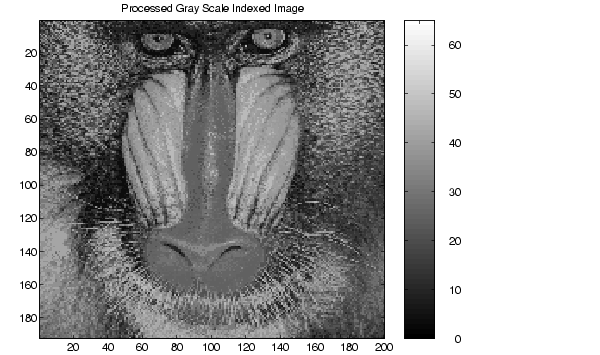

Uma imagem digital é uma função com o seguinte domínio e contra-domínio:

$$ ImagemDigital: VertDiscreto \times HorizDiscreto \rightarrow Inteiros $$
Por exemplo:

[Aula01](../Aula01.md)
[1 Sinais e Sistemas](topicos/1%20Sinais%20e%20Sistemas.md)
[1-1 Sinais em tempo contínuo e em tempo discreto](topicos/1-1%20Sinais%20em%20tempo%20contínuo%20e%20em%20tempo%20discreto.md)
Anterior: [valor de fecho de índice de bolsa](valor%20de%20fecho%20de%20índice%20de%20bolsa.md)
Próximo: [video digital](video%20digital.md)
