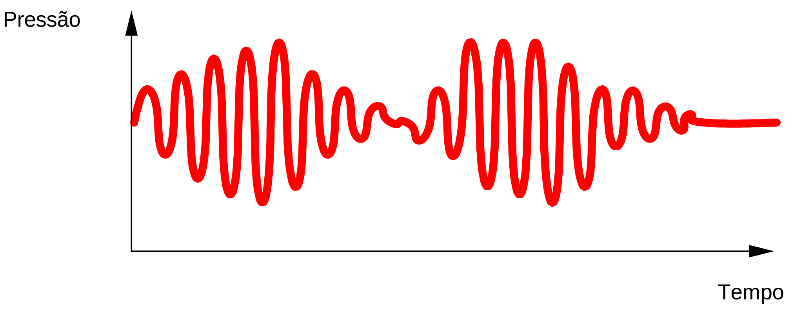

Se $s$ for um sinal acústico:

$$ s: \text{Tempo} \rightarrow \text{Pressão}$$

Podemos representá-lo como uma [função matemática](aula01/ss-sin/função%20matemática.md):

$$ \forall t \in \mathbb{R}, s(t) = \ldots $$
$$ s: \mathbb{R} \rightarrow \mathbb{R} $$
Trata-se de um [sinal em tempo contínuo](aula01/ss-sin/sinal%20em%20tempo%20contínuo.md) que pode ser representado graficamente:

Um [tom puro em tempo contínuo](aula01/ss-sin/tom%20puro%20em%20tempo%20contínuo.md) é um exemplo de um sinal acústico.

Navegação:
- [Aula01](../Aula01.md)
- [1 Sinais e Sistemas](topicos/1%20Sinais%20e%20Sistemas.md)
- [1-1 Sinais em tempo contínuo e em tempo discreto](topicos/1-1%20Sinais%20em%20tempo%20contínuo%20e%20em%20tempo%20discreto.md)
- Anterior: [1-1 Sinais em tempo contínuo e em tempo discreto](topicos/1-1%20Sinais%20em%20tempo%20contínuo%20e%20em%20tempo%20discreto.md)
- Próximo: [função matemática](função%20matemática.md)