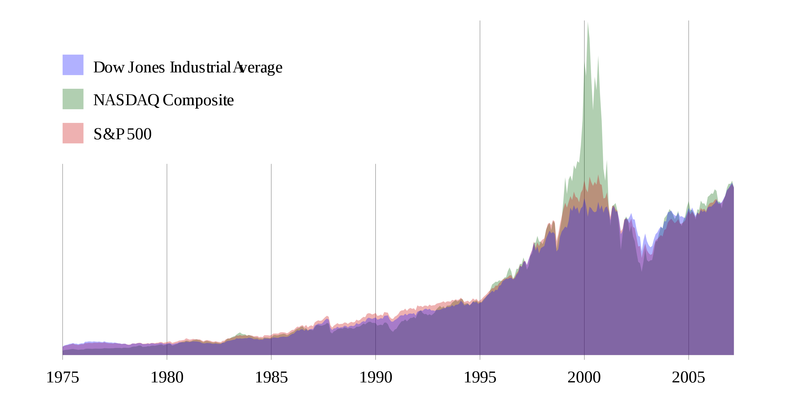

O índice de um mercado de capitais é uma combinação da cotação das ações das empresas mais importantes desse mercado, pesada pela suas capitalizações em bolsa.

Na análise da evolução histórica de um índice usa-se normalmente o seu valor no final do dia (fecho do mercado).

[Aula01](../Aula01.md)
[1. Sinais e Sistemas](../../topicos/1.%20Sinais%20e%20Sistemas.md)
[1.1 Sinais em tempo contínuo e em tempo discreto](../../topicos/1.1%20Sinais%20em%20tempo%20contínuo%20e%20em%20tempo%20discreto.md)
Anterior: [sinal em tempo discreto](sinal%20em%20tempo%20discreto.md)
Próximo: [imagem digital](imagem%20digital.md)