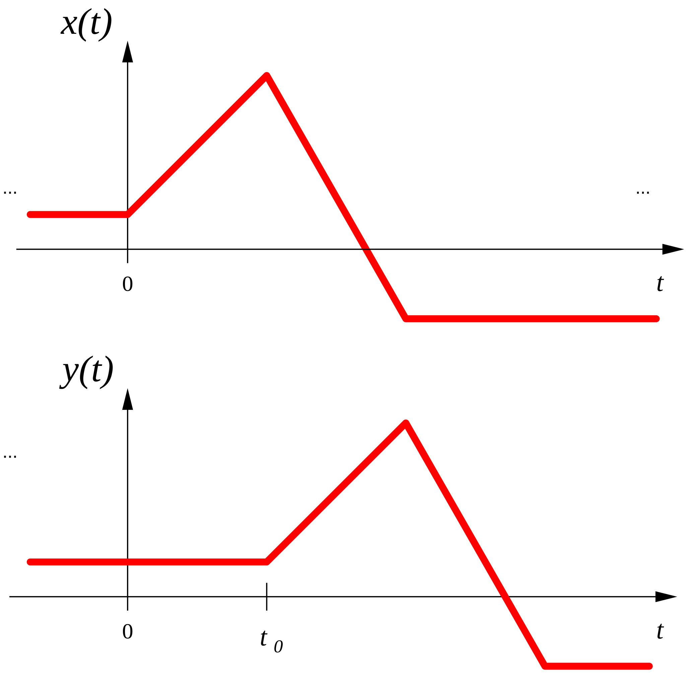

# [deslocamento temporal em tempo contínuo](deslocamento%20temporal%20em%20tempo%20contínuo.md)

Deslocamento temporal pela constante $t_0$:

$y(t)=x(t-t_0),\; t, t_0 \in \mathbb{R}$

Exemplo para $t_0>0$:

[Aula01](../Aula01.md)
[1. Sinais e Sistemas](../../topicos/1.%20Sinais%20e%20Sistemas.md)
[1.2 Transformação da variável independente](../../topicos/1.2%20Transformação%20da%20variável%20independente.md)
Anterior: [1.2 Transformação da variável independente](../../topicos/1.2%20Transformação%20da%20variável%20independente.md)
Seguinte: [inversão temporal](inversão%20temporal.md)
