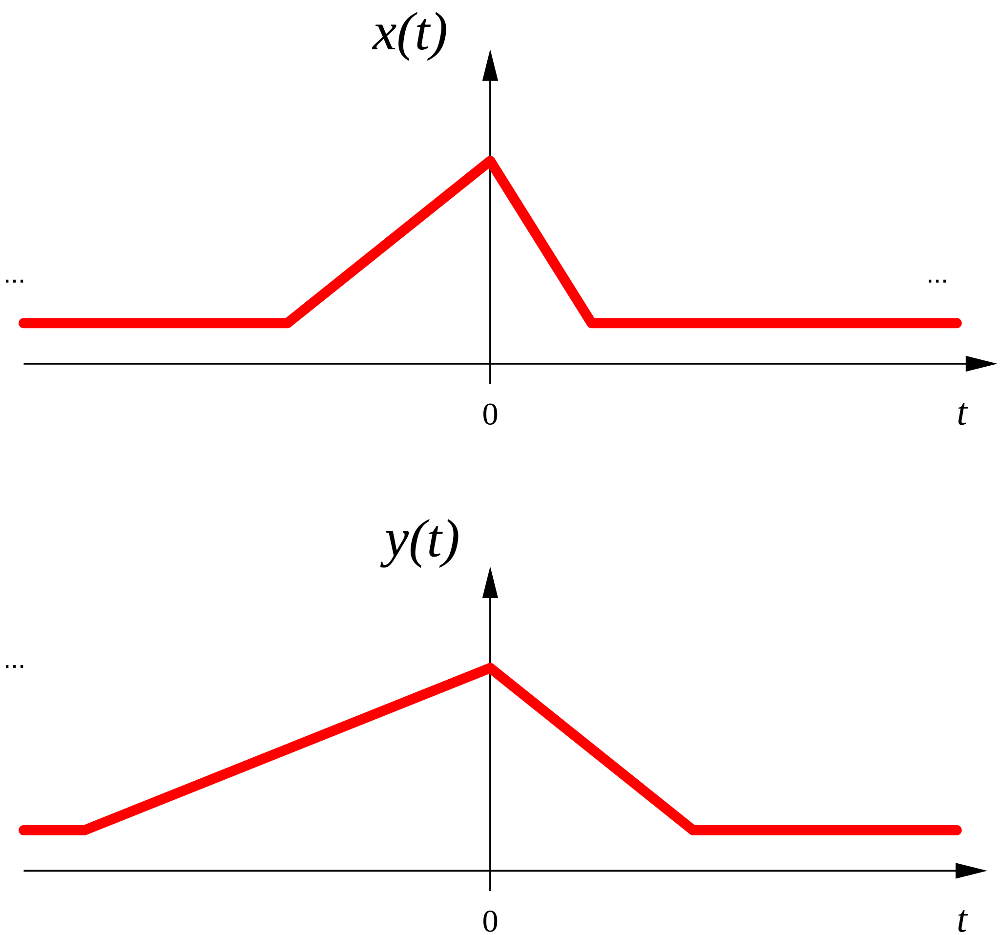

# [escalamento temporal](escalamento%20temporal.md)

A multiplicação da variável independente por uma constante $a$ faz uma expansão ou contração do gráfico da função:

$y(t)=x(at),\; t,a \in \mathbb{R}$

Exemplo para $a \in ]0,1[$:

[Aula01](../Aula01.md)
[1. Sinais e Sistemas](../../topicos/1.%20Sinais%20e%20Sistemas.md)
[1.2 Transformação da variável independente](../../topicos/1.2%20Transformação%20da%20variável%20independente.md)
Anterior: [inversão temporal](inversão%20temporal.md)
Seguinte: [sinais pares e ímpares](sinais%20pares%20e%20ímpares.md)

