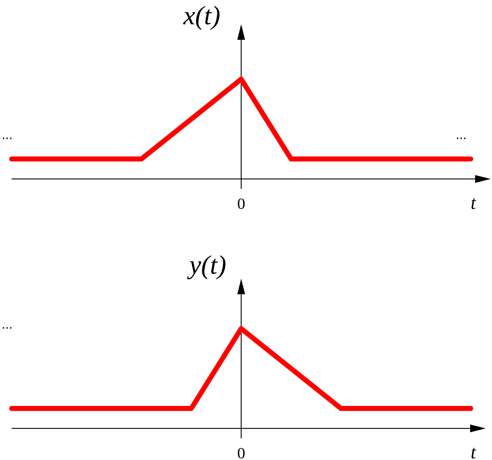

# [inversão temporal](inversão%20temporal.md)

A multiplicação por $-1$ da variável independente faz a inversão temporal da função:

$y(t)=x(-t),\; t \in \mathbb{R}$

[Aula01](../Aula01.md)
[1. Sinais e Sistemas](../../topicos/1.%20Sinais%20e%20Sistemas.md)
[1.2 Transformação da variável independente](../../topicos/1.2%20Transformação%20da%20variável%20independente.md)
Anterior: [deslocamento temporal em tempo contínuo](deslocamento%20temporal%20em%20tempo%20contínuo.md)
Seguinte: [escalamento temporal](escalamento%20temporal.md)
