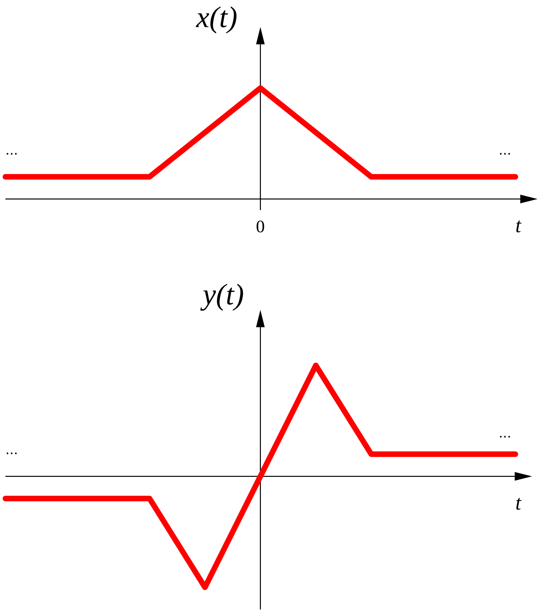

# [sinais pares e ímpares](sinais%20pares%20e%20ímpares.md)

Um sinal é _par_ se for igual à sua inversão temporal
$$x(t)=x^\ast(-t),\; \forall t \in \mathbb{R}$$
Onde $x^\ast$ representa o [complexo conjugado](complexo%20conjugado) de $x$

Um sinal é _ímpar_ se:
$$x(t)=-x^\ast(-t),\; \forall t \in \mathbb{R}$$

Por exemplo, sinal real $x(t)$ é par enquanto o sinal real $y(t)$ é ímpar:

[Aula01](../Aula01.md)
[1 Sinais e Sistemas](topicos/1%20Sinais%20e%20Sistemas.md)
[1-2 Transformação da variável independente](topicos/1-2%20Transformação%20da%20variável%20independente.md)
Anterior: [escalamento temporal](escalamento%20temporal.md)
Seguinte: [componente par e ímpar de um sinal](componente%20par%20e%20ímpar%20de%20um%20sinal.md)
